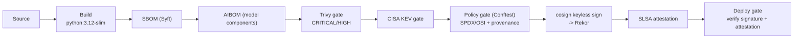

# AI Supply-Chain Secured Pipeline

I built a supply-chain-secured CI/CD pipeline around an intentionally vulnerable AI application — a model registry with a chat endpoint. Every build gets inventoried (SBOM + AIBOM), scanned (CVSS + CISA KEV), policy-checked (SPDX/OSI licenses, model provenance), keylessly signed (Sigstore), attested (SLSA), and only then allowed to deploy. The pipeline is the product; the app is the demo victim whose core vulnerability — unverified model ingestion — is exactly what the pipeline prevents.

The point: *you can attack the app's own bugs all you want — you can only ever deploy the exact artifact that was built, scanned, signed, and attested.*

## The pipeline



## Controls

| Control | Tool | Catches |
|---|---|---|
| Inventory | **Syft** → CycloneDX SBOM | Unknown contents — you can't scan what you don't list |
| AI inventory | **build_aibom.py** → `model` components | Swapped/poisoned models (hash + source enforced) |
| Vulnerability scan | **Trivy** (CVSS CRITICAL/HIGH) | Known CVEs; fails build on fixable findings |
| Actively-exploited | **CISA KEV gate** | CVEs being weaponized right now |
| Policy | **Conftest/OPA** (SPDX/OSI + AIBOM) | Forbidden licenses, missing model provenance |
| Signing | **cosign** (keyless, Sigstore) | Tampered images; signatures in **Rekor** |
| Provenance | **SLSA v1** attestation | "Who built this, from what, how" |
| Deploy | **cosign verify + verify-attestation** | Unsigned/unattested images never run |
| Secrets | **Gitleaks** + gitignore | Leaked credentials |

## Quickstart (local)

Requires: Docker, Python 3.12, and the pinned CLI tools (Syft, Trivy, cosign, Conftest — versions in `scripts/pipeline-local.sh`).

```bash
# Full pipeline: build → SBOM → AIBOM → scan → KEV → policy → sign → attest
IMAGE=localhost:5000/ai-model-registry:dev bash scripts/pipeline-local.sh
```

(For local signing/verification, push to a local registry: `docker run -d -p 5000:5000 registry:2 && docker push localhost:5000/ai-model-registry:dev`.)

### Audit it yourself — no keys needed

```bash
IMAGE=localhost:5000/ai-model-registry:dev \
  CERT_IDENTITY="<id>+<user>@users.noreply.github.com" \
  CERT_ISSUER=https://github.com/login/oauth \
  bash scripts/verify.sh
```

## On GitHub

Push to `main` and `build-scan-sign.yml` runs the same stages with the GitHub Actions identity — plus the official SLSA generator (`slsa-generator.yml`) and release-time SBOM/AIBOM attachment (`release.yml`). Dependabot keeps dependency-update PRs flowing.

## Repository layout

```
app/                 # intentionally-vulnerable target (FastAPI registry + chat)
policy/              # Conftest/OPA policies (sbom.rego + sbom_test.rego)
scripts/             # pipeline-local.sh, build_aibom.py, kev-gate.py, deploy-local.sh, verify.sh
.github/workflows/   # CI, SLSA generator, release, dependabot
docs/                # how-it-works, architecture, threat-model, case-study, faq
.trivyignore         # explicit, commented baseline for no-fix base-image CVEs
```

## Documentation

- **[How it works](docs/how-it-works.md)** — every stage: what it does, which attack it catches, why the order, how to read outputs
- **[Architecture](docs/architecture.md)** — design + local-vs-GitHub parity
- **[Threat model](docs/threat-model.md)** — attack scenarios mapped to controls and standards
- **[Case study](docs/case-study.md)** — the story: the process, how it was used, what it caught
- **[FAQ](docs/faq.md)** — 30 questions with answers

## License

MIT