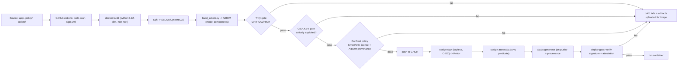

# Architecture

This is the design I settled on after building the pieces and watching how they actually behave. I started with the control I cared about most — *"only verified artifacts ship"* — and worked backward to what that requires.

## The pipeline



## Local vs. GitHub — the same pipeline, two identities

I wanted the pipeline to be fully reproducible on a machine with Docker and four CLI tools, so I built `scripts/pipeline-local.sh` to run the identical stages locally. The differences are only in *who signs*:

| | Local (`pipeline-local.sh`) | GitHub (`build-scan-sign.yml`) |
|---|---|---|
| Sign identity | Ambient GitHub OIDC (`<id>+user@users.noreply.github.com`) | GitHub Actions workflow identity |
| Registry | Local `registry:2` on :5000 | GHCR |
| Provenance | `cosign attest` (SLSA v1 predicate) | Official SLSA GitHub Generator + `slsa-verifier` |
| Verify | `cosign verify-attestation` | `slsa-verifier verify-artifact` |

Both are keyless. Neither needs a stored secret. That parity matters to me — the story should survive "run it on your laptop."

## Components

| Path | Responsibility |
|---|---|
| `app/` | The intentionally-vulnerable target: FastAPI model registry (`/models` upload/fetch/serve) + chat (`/chat`, prompt-injection) + evaluator |
| `app/Dockerfile` | `python:3.12-slim`, non-root user, uvicorn worker, healthcheck |
| `app/models/manifest.json` | Shipped model metadata — the AIBOM source |
| `policy/sbom.rego` | Standards-driven license + AIBOM-provenance policies |
| `policy/sbom_test.rego` | 7 policy test cases |
| `scripts/pipeline-local.sh` | The full 8-stage local pipeline |
| `scripts/build_aibom.py` | Merges CycloneDX `model` components into the SBOM |
| `scripts/kev-gate.py` | CISA KEV actively-exploited gate |
| `scripts/deploy-local.sh` | Gated deploy: verify signature + attestation, then run |
| `scripts/verify.sh` | Third-party audit: signature, attestation, vulnerabilities |
| `.github/workflows/` | CI (build-scan-sign), SLSA provenance, release, dependabot |
| `.trivyignore` | Explicit, commented baseline for 8 no-fix base-image CVEs |

## Why the pieces are separate

Every unit has one job and one interface:

- `build_aibom.py` reads an SBOM + manifest, writes an SBOM — nothing else. It's unit-tested against fixtures.
- `kev-gate.py` reads Trivy JSON, exits 0 or 1 — nothing else.
- The Rego policies know only about SBOM shapes, never about the pipeline.
- The shell scripts are thin orchestrators that call the tools in order.

This means each piece is independently testable and replaceable. If I want to swap Trivy for Grype tomorrow, the KEV gate and the policy don't care. That separation is what made the fixes during development (the predicate format, the license-name form) cheap.

## Artifact flow

```
artifacts/
├── sbom.cdx.json        # Syft inventory (CycloneDX)
├── sbom-aibom.cdx.json  # + model components (the AIBOM)
├── trivy.json           # full scan report (JSON)
└── slsa-provenance.json # bare SLSA v1 predicate (attested)
```

These four files are what a reviewer — or a recruiter, or an auditor — inspects. Everything else in the pipeline is how they get produced honestly.